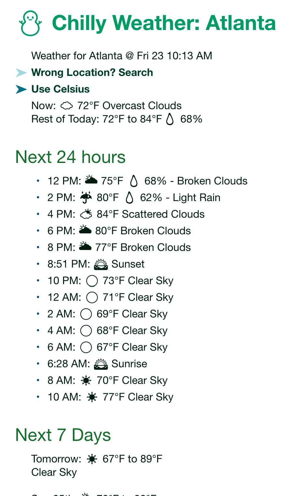
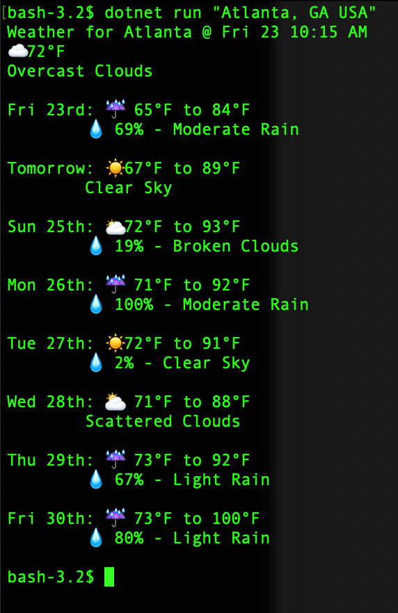

# ChillyWeather
 Weather on the command line, and on [Gemini](https://en.wikipedia.org/wiki/Gemini_(protocol)) via a CGI. Uses OpenWeather for forecast and freeipapi.com for IP-to-location. 

 ## Gemini CGI:

 

 ## Console:
 
 
